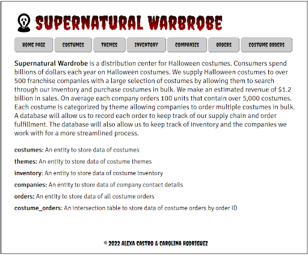
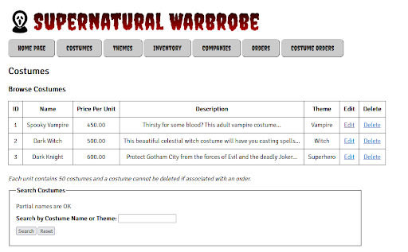
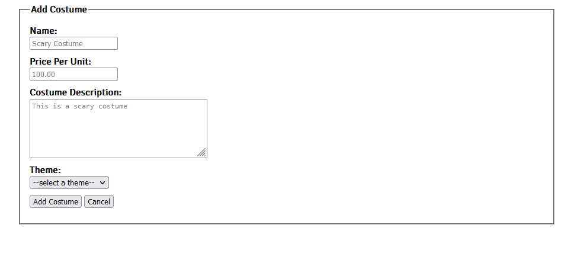
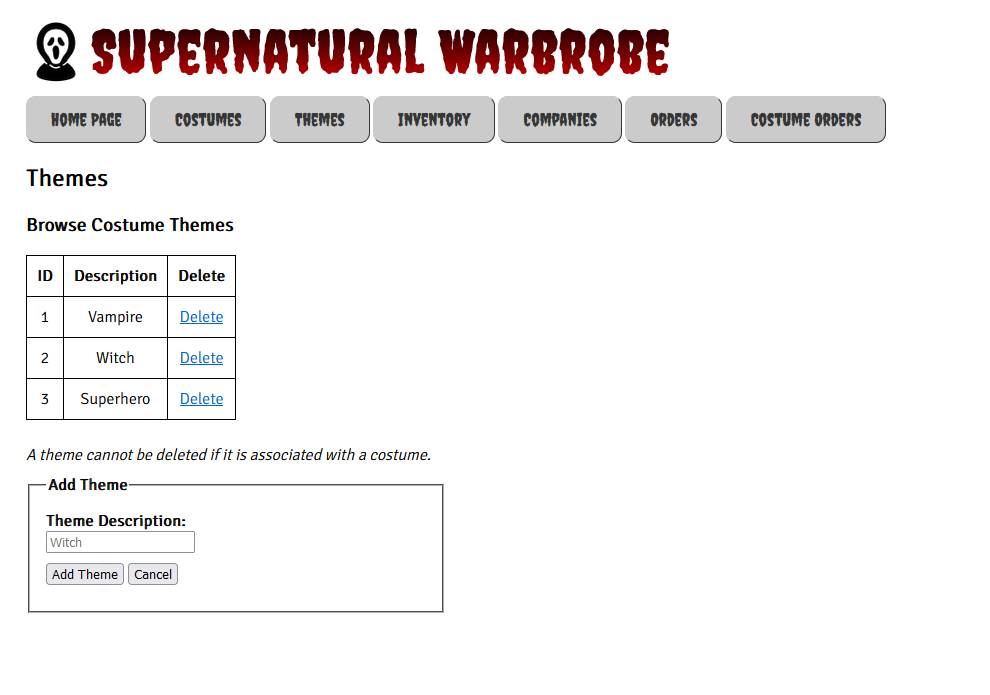
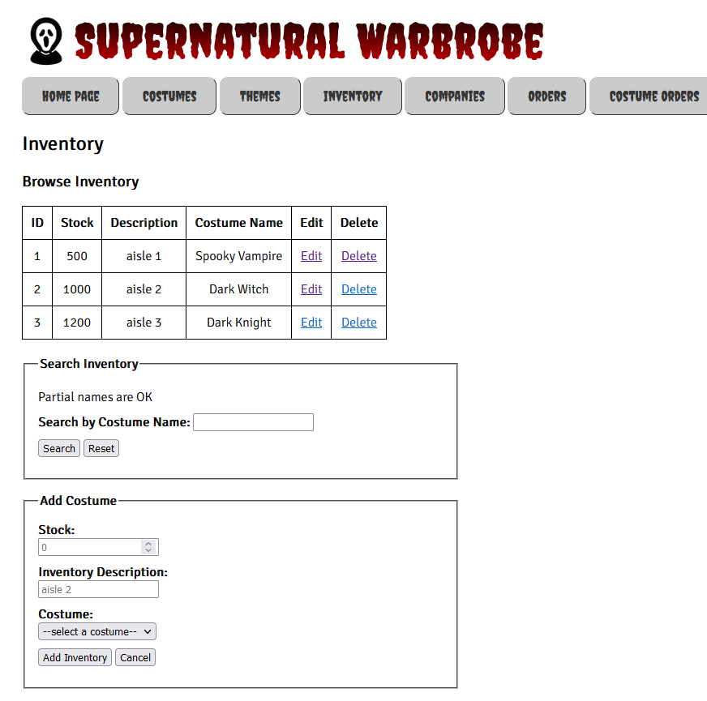
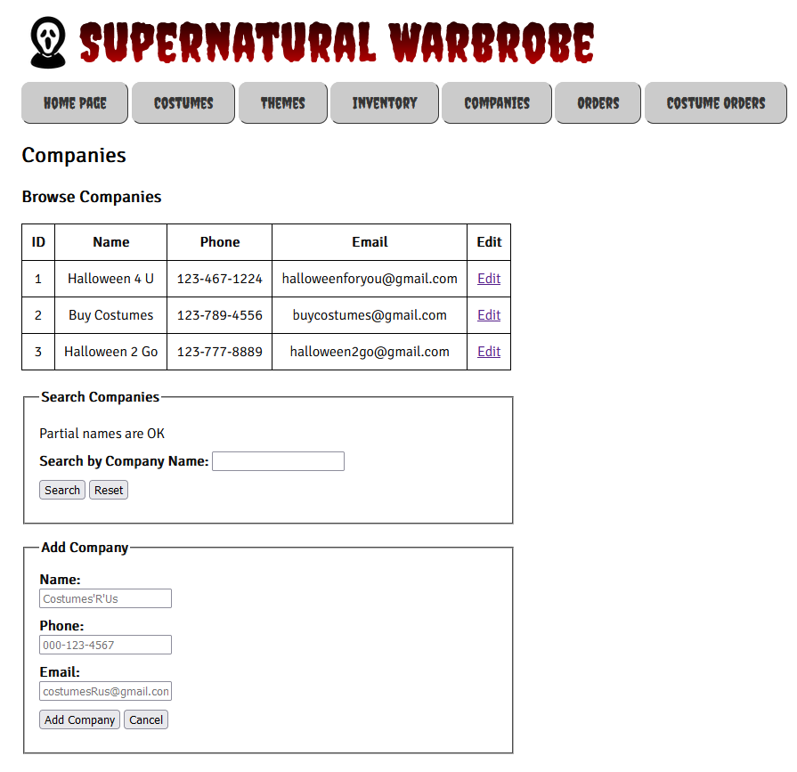
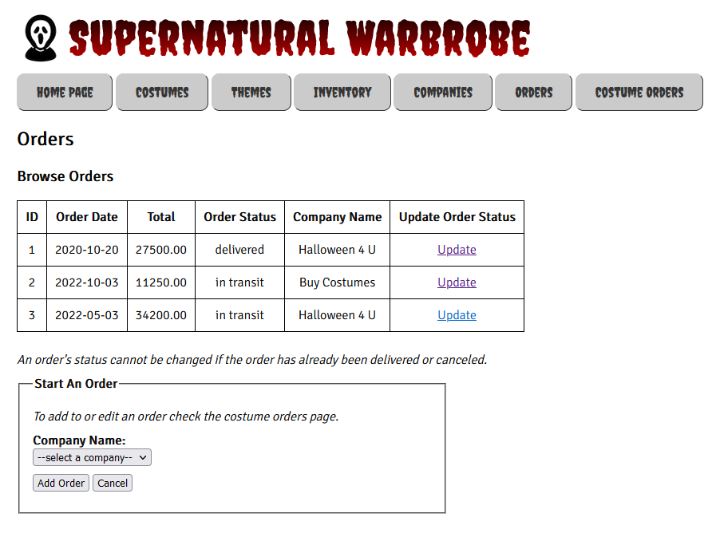
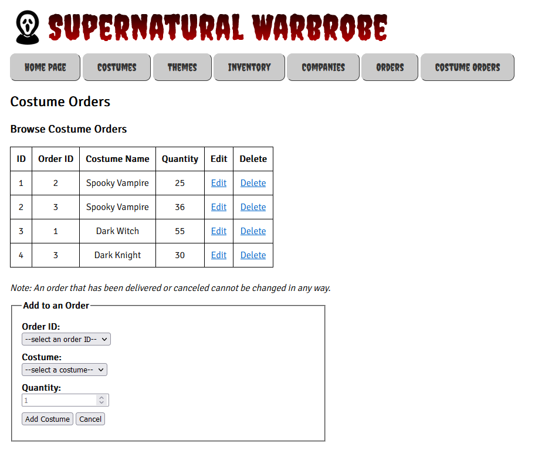

# Supernatural Wardrobe

# Description

Designed and implemented a web app using Python, Flask, and Jinja2 with a MySQL backend
Created Fall 2022 by Alexa Castro and Carolina Rodriguez.

Web-based UI implements a database for a costume warehouse. This contains 5 entities
costumes, themes, inventory,companies, and orders. An intersection table between costume
and orders. CRUD Implemenations such as CREATE/UDPATE/DELETE/SELECT can be performed 
on this app.

## Built with
- Flask
- Python
- MySQL
- Jinja2
- CSS

## Screenshots
<figcaption>Home Page</figcaption>

<figcaption>Create/Read/Update/Delete/Search Costumes Page</figcaption>

<figcaption>Create/Read/Delete Themes Page</figcaption>

<figcaption>Create/Read/Update/Delete/Search Inventory Page</figcaption>

<figcaption>Create/Read/Update/Search Companies Page</figcaption>

<figcaption>Create/Read/Update Orders Page</figcaption>

<figcaption>Create/Read/Update/Delete Costume Orders</figcaption>

